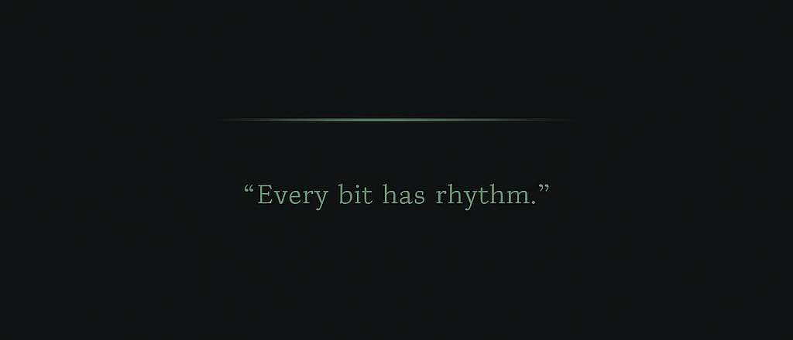

  

  <i>“Every bit has rhythm.”</i>

<h1 align="center">Hi, I'm Can</h1>

Focused on structure, clarity, and precision.  
Learning to write cleaner code and think with design.

### 🧩 Principles
- Minimal structure  
- Consistent logic  
- Meaningful spacing  
- Silent details

---

### 🧠 Currently interested in
- System thinking  
- Front-end foundations  
- Design patterns in simplicity  

---

### 🔭 Now
- Refactoring my personal workflow  
- Studying UI rhythm and code aesthetics  
- Building something quiet but meaningful

---

### 🧰 Toolbox
HTML • CSS • JavaScript • React • VSCode

  

---

  <i>"Order is beautiful when it breathes."</i>

  Built with <code>clarity</code> & <code>silence</code>.

